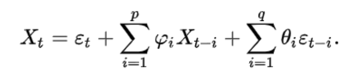
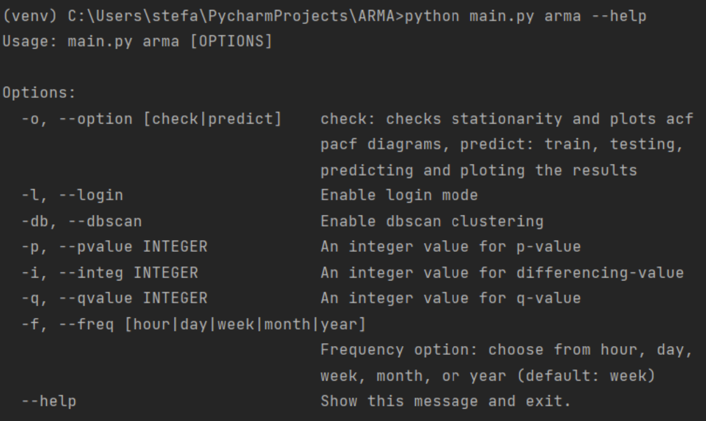
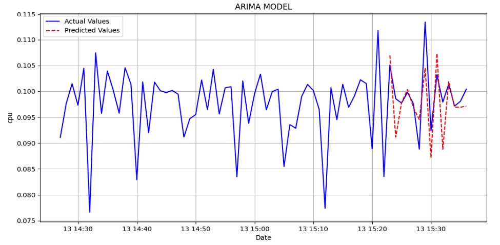

# Proxmox

## Architecture


## API

Swagger: http://localhost:8080/swagger-ui/index.html

### Install

```bash
.\mvnw --version
Apache Maven 3.6.3

docker -v
Docker version 25.0.3

.\mvnw clean package

docker-compose up
[+] Running 3/3
✔ Network scripts_default Created
0.0s
✔ Container iris_db Created
0.1s
✔ Container api_promox Created
```

### Examples

```bash
curl --location 'http://localhost:8080/api/auth/signup' \
--header 'Content-Type: application/json' \
--data-raw '{
"username": "χχχχχχχχχχχχχχχ",
"email": "χχχχχχχχχχχχχχχ",
"password": "χχχχχχχχχχχχχχχ"
}'
Response:
{
"message": "User registered successfully!"
}

curl --location 'http://localhost:8080/api/auth/signin' \
--header 'Content-Type: application/json' \
--data-raw '{
"username": "testadmin@pve",
"password": "XXXXXXXXXXXXX"
}'
Response:
{
"roles": [
"ROLE_USER"
],
"CSRFPreventionToken":"xxxxx",
"ticket":"xxxx",
"username": "xxxx",
"clustername": "xxxx"
}

curl --location 'http://localhost:8080/api/user/vm/create' \
--header 'Content-Type: application/json' \
--header 'Cookie: <Reducted>' \
--data '{
"startDate": "2024-08-18T19:00:00Z",
"endDate": "2024-08-19T20:00:00Z",
"processors": 2,
"storage": 32,
"memory": 4192,
"os": "Linux"
}'
Response:
{
"message": "Request added successfully!"
}

etc... Check swagger and controllers
```

## Python



### CLI




### Commands

```bash
python main.py arma -o check -f day -d loadavg
Augmented Dickey–Fuller test
ADF Statistic: -3.476634013938528
p-value: 0.008607855605303801

python main.py arma -o predict -f day -d loadavg -p 7 -q 3
Results:
Mean Squared Error: 2.2216031030805403e-05
Mean Absolute Error: 0.0034921627554498277
```

### Results


